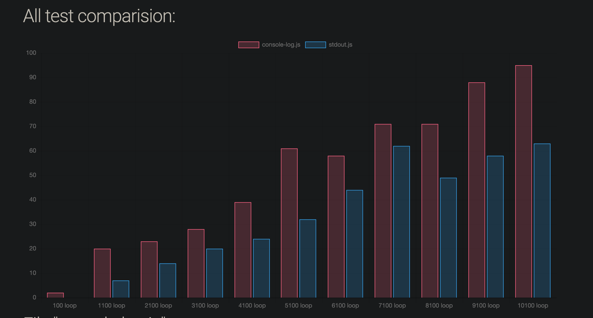
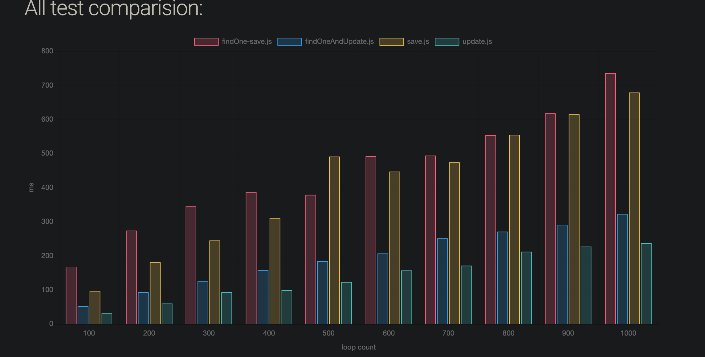

# Some Node.js fun facts

This repos is for education & research.


## Console.log is expensive
 If you are using `console.log` to keep information logged in production, let me tell you that you are downgrading your performance.

Adding a simple `console.log` add an extra time. The simpler explanation: Node.js is asyncronous so when you add a console.log you are forcing it to make some syncs operations affection your performance.
#### Data here
I made some test using [`micron-runner`](https://github.com/ivanhuay/micron-runner) (a benchmark library that i made), you can find the results [here](https://ivanhuay.github.io/micron-runner-example/) and the [repo here](https://github.com/ivanhuay/micron-runner-example)


micron test this type of things making a simple loop and measuring times.

#### Solution:
Use some loggers writing to a file or you can use `process.stdout.write`

## process.env isn't that innocent
Are you using env variables? well there is a bad way and a good way to do that.

When you make a simple `process.env` you are calling a system function so it is expensive too in terms of time.

The best choice is using those variables only one time per file, maybe just in the top saving those values in a const.

```javascript
const EXAMPLE = process.env.EXAMPLE;

function getExample(){

//...
//awesome code here

}

module.exports = getExample;
```

if you use the same thing inside the function each time you run `getExample` it'll consume an extra time.

#### Data here
as always i made a quick test using [`micron-runner`](https://github.com/ivanhuay/micron-runner).

You can find it [here](https://github.com/ivanhuay/micron-process-env)


As expected before running the test, using `process.env` each times consume more time.

This was a simple example but in real life, you maybe will use a huge .env file and times would be much higher.


# Mongo & mongoose fun facts
this section es specially dedicated to mongoose & mongo related fun facts.

## Mongose: `Find` vs `FindOne`.

Some time ago i made a benchmark between `update`, `find and save`, `findOne & save' & `findOneAndUpdate`. The results was kind obvious but it is interesting to keep in mind.

`update` is only one operation so make sense if `update` is faster than making two operations `find & save` or `findAndUpdate`.

The really interesting thing here is that sometime `find` is faster than making `findOne`.

#### Results
`save` script makes a separated `find` & `save`, `findOne-save` is similar but using  `findOne`.

check the [results here](https://ivanhuay.github.io/micron-mongoose-update-vs-save/) and the [code here](https://github.com/ivanhuay/micron-mongoose-update-vs-save).

It is quite fun that using `findOne` make his job worst than a simple `find`.

The quick explanation is that find returns a cursor and not actual data, but findOne yes so this cost some time.
